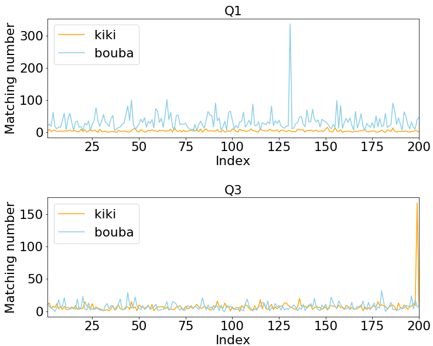
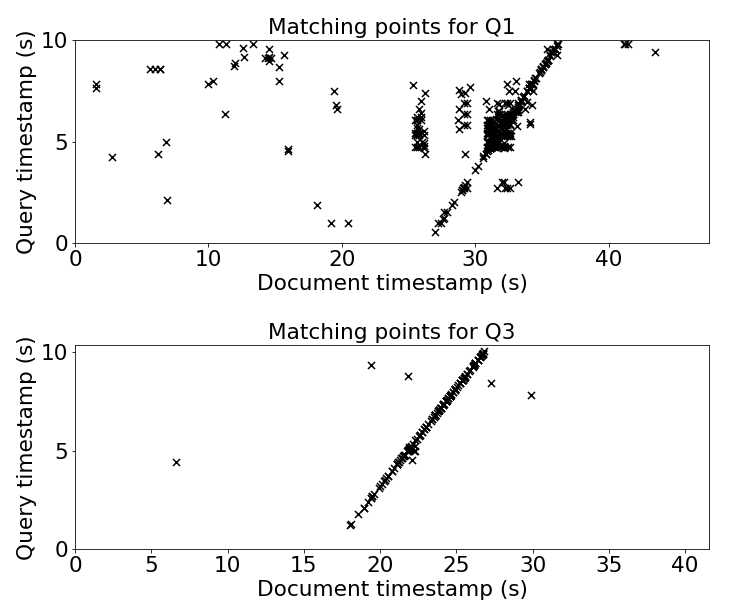

### Music Informatics Project
This project is about audio identification. A fingerprint system is built to determine the source database of queries. Besides, an implementation for building chroma features has also been included for comparison.
##### Dataset
- Dataset: 
  - 2 query files: under the folder of `./queries/`
  - 2 databases: kiki and bouba, each of them has 200 source files under the folder of `./dataset/kiki/` and `./dataset/bouba/`

Notes: Here only part of datasets have been uploaded because they are too large and it will also take long time to run.

##### Run this project
1. To get match results between all queries and databases, run `python main.py`
2. To draw the analysis plots, run `python plot.py`

   The following figure shows the number of Matched anchors between 2 queries and all documents in kiki and bouba databases.
   
   
   
   The corresponding matched timestamps between 2 queries and the documents with top matched number are shown as below.
   
   
   
3. To draw the chromagrams, run `python chroma.py`
